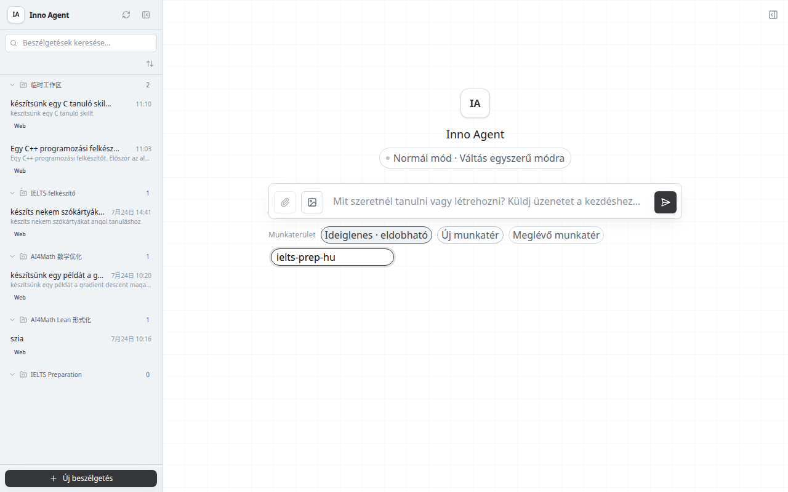
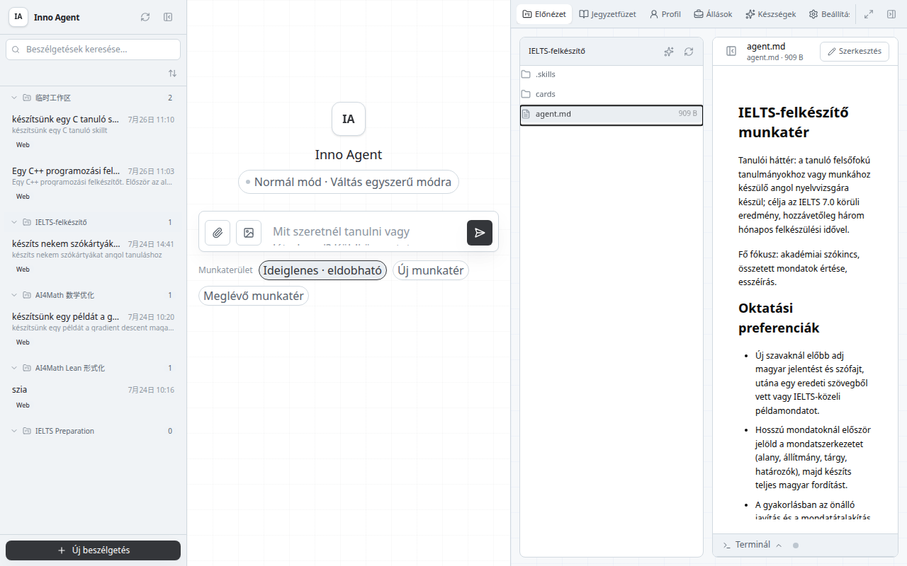
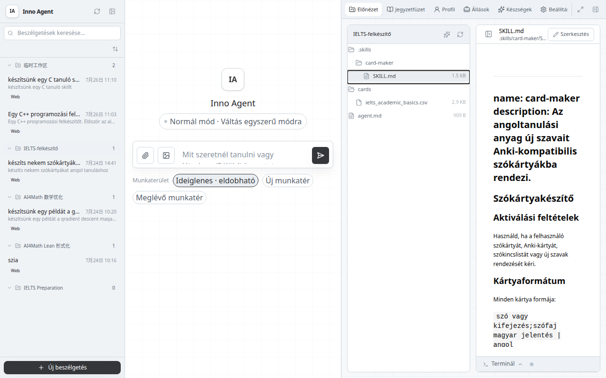
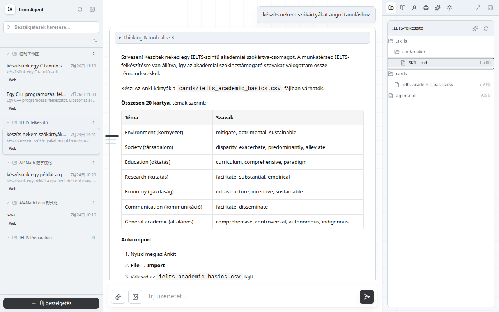
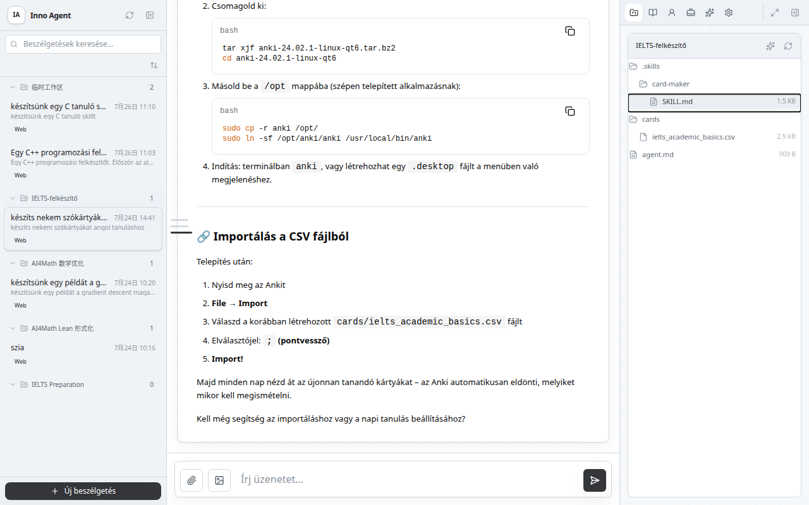
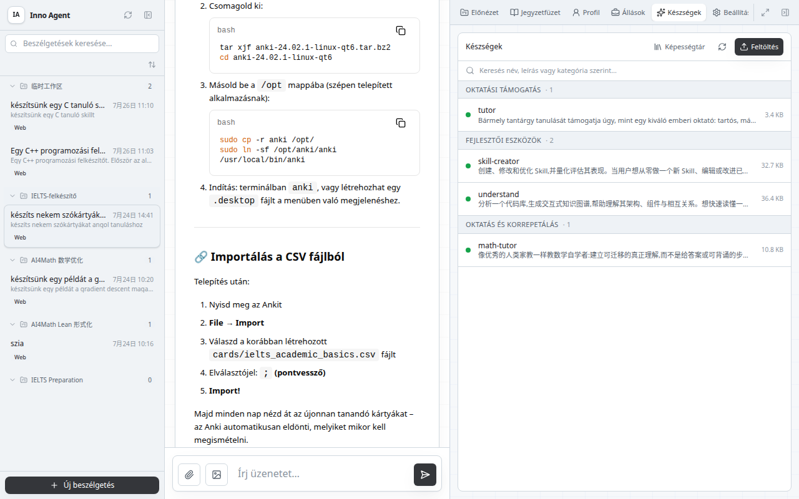

# Inno Agent használati útmutatója: saját tanulási ügynök építése

**Verzió:** v0.2.3 · 2026-06-07 · Kelet-kínai Pedagógiai Egyetem Sanghaji Intelligens Oktatási Kutatóintézete

Ez az útmutató az „angol nyelvvizsga-felkészülés” munkatér példáján mutatja be, hogyan határozható meg a munkatér kontextusa az `agent.md` segítségével, hogyan adhatók hozzá célzott képességek a `.skills/` könyvtárban, és hogyan építhető egy konkrét munkatérhez saját viselkedésű tanulási ügynök.

---

## 1. A működés logikája

A rendszerutasítás két, eltérő időpontban beillesztett szakaszból áll össze:

```
━━ Rögzítve a beszélgetés létrehozásakor (Pi SDK) ━━━━━━━━━━━━━━━━━━━━━━━━━━

  INNO alap rendszerutasítás
    ↓
  Globális Skillek             ← a Készségek panelen telepítve, minden munkatér közös használatára
    ↓
  Aktuális dátum + munkakönyvtár

━━ Dinamikusan beillesztve minden beszélgetési körben (before_agent_start hook) ━

  L1 kontextuscsomag (tanulási cél / tudásszint / félreértések / preferenciák)
    ↓
  Munkatérhez kötött kontextus ← a munkatérrel együtt jár, minden körben újraolvasva
    ├── agent.md               a munkatér gyökérkönyvtára, közvetlenül írható, feltöltés nélkül
    └── .skills/               a munkatér eszköztárának ✦ gombjával feltöltött skillcsomagok
    ↓
  L3 beszélgetések közötti felidézés
    ↓
  A legutóbbi kódfuttatás naplója
```

**Két fájl, két belépési pont: ne cserélje fel őket.**

| Fájl | Hova kerüljön | Hogyan hozható létre | Mit határoz meg |
|---|---|---|---|
| `agent.md` | a munkatér gyökérkönyvtára | Készíttesse el az ügynökkel, vagy írja közvetlenül a beszélgetésben | a munkatér személyisége: tanulási háttér, preferenciák, fájlleírások |
| `.skills/<név>/SKILL.md` | a munkatér `.skills/` alkönyvtára | Az eszköztár ✦ gombjával töltsön fel `.md` vagy `.zip` fájlt | célzott képesség: aktiválási feltételek, formátumszabályok, munkafolyamat |

---

## 2. Új munkatér létrehozása

1. A bal oldali beszélgetéslistában kattintson alul a **+ Új beszélgetés** lehetőségre.
2. Válassza az **Új munkatér** opciót, majd névként adja meg: `ielts-prep`.
3. Kattintson a **Létrehozás** gombra.



---

## 3. Az agent.md létrehozása

Az `agent.md` a munkatér **gyökérkönyvtárába** kerül, és nem a skillfeltöltési folyamaton keresztül jön létre. Kétféleképpen készítheti el:

**A módszer: készíttesse el az ügynökkel (ajánlott)**

Az új beszélgetés beviteli mezőjébe illessze be és küldje el közvetlenül az alábbi sablont:

```
Kérlek, hozz létre egy agent.md fájlt az aktuális munkatér gyökérkönyvtárában az alábbi tartalommal:

## Angol nyelvvizsga-felkészülési munkatér

Tanulói háttér: teljesítettem az egyetemi angol nyelvvizsga hatodik szintjét, a célom IELTS 7 pont, a felkészülési idő körülbelül 3 hónap.
Tanulási fókusz: tudományos szókincs bővítése, összetett mondatok megértése, esszéírás.

### Oktatási preferenciák
- Ismeretlen szavak magyarázata: először a magyar jelentés és a szófaj, majd egy, az eredeti szövegből vett példamondat
- Összetett mondatok: először jelöld a mondatszerkezetet (alany/állítmány/tárgy/határozó), majd fordítsd le az egész mondatot
- Gyakorlatok: főként hibajavító és mondatutánzó feladatok, kevés feleletválasztós kérdés

### A munkatér fájljai
- cards/   szókincsismétlő kártyák (Anki CSV-formátumban)
- notes/   szövegközeli olvasási jegyzetek
```

Az ügynök meghívja a fájlíró eszközt; az `agent.md` ezután megjelenik a jobb oldali munkatérhez tartozó fájlfában, a gyökérkönyvtárban.

**B módszer: kézi létrehozás szövegszerkesztővel**

Mentse a fenti sablont `agent.md` néven bármely szövegszerkesztőben (például VS Code-ban vagy Jegyzettömbben), majd húzza a fájlt a jobb oldali munkatérhez tartozó fájlfa panel üres területére. Ügyeljen arra, hogy a fájlfában ne legyen kijelölve alkönyvtár: így a fájl a munkatér gyökérkönyvtárába töltődik fel. Ha a `.skills/` könyvtár van kijelölve, a rendszer skillcsomagként kezeli a fájlt.



> **Figyelem:** az `agent.md` közönséges Markdown-fájl, nincs szüksége frontmatterre. A rendszer beillesztéskor automatikusan hozzáadja a `# Munkatérhez kötött kontextus (agent.md)` címet.

---

## 4. Szókártya-készítő Skill feltöltése

A kártyakészítő célzott képesség: a munkatér eszköztárának **✦ gombjával** tölthető fel, és a `.skills/` könyvtárba települ.

### 4.1 A skillfájl előkészítése

Hozzon létre egy `card-maker.md` nevű fájlt szövegszerkesztővel, és írja bele a saját igényeinek megfelelő tartalmat. Az alábbi példa közvetlenül másolható. A fájl tetején `---` jelek közé zárt frontmatter használata erősen ajánlott: ez egyértelmű nevet és leírást ad a Skillnek, így javítja annak megtalálhatóságát és kiválasztását. Frontmatter nélkül a rendszer megőrzi a feltöltött Skillt, de általános tartalék leírást hoz létre hozzá.

````markdown
---
name: card-maker
description: Az angol tananyag ismeretlen szavaiból Anki-kompatibilis szókincskártyákat készít
---

## Szókincskártya-készítő

### Aktiválási feltételek

Amikor a felhasználó azt mondja, hogy „készíts kártyákat”, „rendezd a szavakat”, „készíts szókártyákat” vagy „Anki-kártyák”, lépj kártyakészítő módba.

### Kártyaformátum

Minden kártya formátuma: `szó vagy kifejezés;szófaj magyar jelentés | eredeti példamondat;címke`

Példasor:

```
ubiquitous;adj. mindenütt jelen lévő | Smartphones have become ubiquitous in daily life.;ielts academic
```

Szabályok:
- A példamondat lehetőleg a felhasználó által adott eredeti szövegből származzon; eredeti szöveg hiányában alkoss az IELTS-környezethez illő mondatot.
- A címke mindig tartalmazza az `ielts` értéket, majd egészítsd ki tartalmi címkével (például `technology` vagy `environment`).
- Egy alkalommal legfeljebb 20 kártyát készíts; kifejezésnél a teljes kifejezés szerepeljen az előoldalon, ne bontsd szét.

### Fájlműveletek

Írd a kártyákat a `cards/<forrástéma>.csv` fájlba; a fejléc mindig a következő legyen:

```
#separator:Semicolon
#html:false
szó vagy kifejezés;jelentés és példamondat;címkék
```

Elkészítés után közöld az elérési utat, a kártyák számát és az Anki importálásának módját (Fájl → Importálás, elválasztó: `;`).

### Memóriakapcsolat

- Az eredeti cikket archiváld a `l2_archive` hívással, a cím formátuma: `[IELTS olvasás] cikk témája`.
- A `record_learning_event` hívással rögzíts `concept_explained` eseményt, a `mastery_delta` értéke legyen 0.01.
````

### 4.2 Feltöltés a munkatérbe

1. A jobb oldalon váltson az **Előnézet** lapra, és nyissa meg a munkatérhez tartozó fájlfát.
2. Kattintson a fájlfa eszköztárának jobb felső részén lévő **✦** gombra; az eszköztipp szövege: „Skillcsomag feltöltése (.zip/.md) a .skills könyvtárba”.
3. Válassza ki a `card-maker.md` fájlt.
4. A feltöltés befejezése után megjelenik a `.skills/card-maker/SKILL.md` fájl.



A feltöltés utáni könyvtárszerkezet:

```
workspace/
└── ielts-prep/
    ├── agent.md              ← munkatér-kontextus (a harmadik lépésben létrehozva)
    └── .skills/
        └── card-maker/
            └── SKILL.md      ← szókincskártya-képesség (a negyedik lépésben feltöltve)
```

### 4.3 Ellenőrzés

**Hozzon létre új beszélgetést**, rendelje hozzá az `ielts-prep` munkateret, majd küldje el:

```
Milyen célzott képességeid vannak ebben a munkatérben?
```

Az ügynöknek egyszerre kell leírnia az angol nyelvvizsga-felkészülés hátterét (az `agent.md` alapján) és a szókincskártya-készítő képességet (a `.skills/card-maker/` alapján).

---

## 5. Teljes folyamat bemutatása

### 5.1 Cikkrészlet szövegközeli feldolgozása

Küldje el:

```
Kérlek, dolgozd fel részletesen ezt a szövegrészletet, különösen az ismeretlen szavakat magyarázd el:

The proliferation of renewable energy sources has been one of the most
significant developments in addressing climate change. Solar and wind power,
once considered too intermittent and costly to be viable alternatives to
fossil fuels, have become increasingly competitive due to technological
advancements and economies of scale.
```

Az ügynök az `agent.md`-ben megadott preferenciák szerint válaszol: a `proliferation`, `intermittent`, `viable` és hasonló ismeretlen szavaknál először magyar jelentést és szófajt ad, majd az eredeti mondatot idézi példaként.



### 5.2 Szókincskártyák létrehozása

A részletes feldolgozás után küldje el:

```
Kérlek, rendezd ennek a cikknek az ismeretlen szavait kártyákba.
```

Az ügynök aktiválja a card-maker képességet, és az alábbihoz hasonló eredményt ad:

```
Elkészült 6 szókincskártya, mentési hely: cards/climate-change.csv

Előnézet:
1. proliferation
   → n. elszaporodás; terjedés | The proliferation of renewable energy sources has been significant.
   Címke: ielts environment

2. intermittent
   → adj. időszakos | Solar power was once considered too intermittent to be viable.
   Címke: ielts environment
... (összesen 6 kártya)

A forrás archiválva: [IELTS olvasás] Climate Change and Renewable Energy
Anki importálása: Fájl → Importálás → cards/climate-change.csv, elválasztó: `;`
```



---

## 6. Iteráció és karbantartás

| Módosítási igény | Teendő |
|---|---|
| Tanulási háttér vagy oktatási preferenciák módosítása | Szerkessze közvetlenül az `agent.md` fájlt; a meglévő, ehhez a munkatérhez rendelt beszélgetés következő ügynökfordulójában lép életbe. |
| A kártyaformátum vagy az aktiválási feltételek módosítása | A munkatérhez tartozó fájlfában kattintson a `.skills/card-maker/SKILL.md` elemre → módosítsa a jobb oldali szerkesztőben → mentse; a meglévő, ehhez a munkatérhez rendelt beszélgetés következő ügynökfordulójában lép életbe. |
| Új célzott képesség hozzáadása | Készítsen új, frontmattert tartalmazó `<név>.md` fájlt, majd töltse fel a ✦ gombbal. |
| Egy képesség letiltása | Törölje a `.skills/<név>/` könyvtárat. |

Mindkét fájlt a rendszer minden `before_agent_start` körben valós időben olvassa, ezért a módosítás a meglévő, ehhez a munkatérhez rendelt beszélgetés következő ügynökfordulójában érvényesül, és nem kell újraindítani a szolgáltatást.

---

## 7. Globális Skill: minden munkatérben használható képesség

A munkatér `agent.md` és `.skills/` tartalma csak az adott munkatérhez rendelt beszélgetésekben érvényes. Ha egy képességre **minden munkatérben szükség van**, globális Skillként telepítse.

### 7.1 Globális Skillnek alkalmas esetek

| Eset | Magyarázat |
|---|---|
| Általános eszköz | Webes keresés, dokumentumformátum-átalakítás, kódfuttatási segítség és hasonlók |
| Projektek közötti tanulási szabály | Például: „minden munkatérben az ügynök egy fogalom elmagyarázása után önállóan adjon egy gyakorló feladatot” |
| Szervezeti vagy csapaton belüli közös szabály | Több felhasználó közös Inno-példánya esetén egységes válaszstílus vagy működési szabály |

Nem alkalmas globális Skillnek a projektspecifikus formázási szabály és az adott munkatér tanulási háttere; ezekhez inkább az `agent.md` vagy a munkatér `.skills/` könyvtára való.

### 7.2 Létrehozás és feltöltés

A globális Skill fájlformátuma megegyezik a munkatérhez kötött Skillével; a jól érthető névhez, leíráshoz és könnyű felfedezhetőséghez a frontmatter erősen ajánlott, de enélküli feltöltéskor is megmarad a Skill egy generált általános leírással:

```markdown
---
name: grammar-checker
description: Ellenőrzi a felhasználó angol szövegének nyelvtani hibáit, és javítási javaslatokat ad
---

## Nyelvtani ellenőrző

Amikor a felhasználó angol mondatot vagy bekezdést küld, sorolja fel egyenként a nyelvtani hibákat, ismertesse a hibatípust, és adja meg a javított mondatot.
```

Feltöltési lépések:

1. A jobb oldali panel tetején kattintson a **Készségek** lapra.
2. Kattintson a jobb felső **Feltöltés** gombra.
3. Válasszon `.md` vagy `.zip` fájlt.
4. A Skill megjelenik a listában, állapota: „Engedélyezve”.



### 7.3 A beillesztés ideje és a munkatérhez kötött Skillel való eltérés

| | Globális Skill | Munkatérhez kötött `.skills/` |
|---|---|---|
| Telepítés helye | `~/.inno-agent/skills/` | `workspace/<név>/.skills/` |
| Feltöltési belépési pont | A jobb oldali **Készségek** lap **Feltöltés** gombja | A munkatérhez tartozó fájlfa ✦ gombja |
| Beillesztés ideje | **A beszélgetés létrehozásakor rögzített**, utána változatlan | Minden `before_agent_start` körben dinamikusan olvasva |
| Hatókör | Minden munkatér minden beszélgetése | Csak az adott munkatérhez rendelt beszélgetések |
| A módosítás érvényesülése | Újrafeltöltés + **új beszélgetés** szükséges | Közvetlen fájlszerkesztés; a meglévő, ehhez a munkatérhez rendelt beszélgetés következő ügynökfordulójában érvényesül |

> **Figyelem:** a globális Skill a beszélgetés létrehozásakor kerül beillesztésre. Ha beszélgetés közben módosítja vagy újra feltölti, az nem érinti a meglévő beszélgetést; az új változathoz új beszélgetést kell létrehozni.

### 7.4 Engedélyezés, letiltás és törlés

A **Készségek** panel Skill-listájában:

- **Engedélyezés/letiltás:** kattintson az elem jobb oldalán lévő kapcsolóra; a következő új beszélgetésben lép életbe.
- **Törlés:** kattintson a törlés ikonra; ezzel a Skill kikerül a globális skills könyvtárból.
- **Frissítés:** kattintson az eszköztár **Frissítés** gombjára; ezzel az összes Skill újratöltődik (a meglévő beszélgetésekre nincs hatással).

---

## 8. Gyakori kérdések

**K: Miért jelenik meg a „Project skill uploaded for...” általános leírás, miután feltöltöttem egy skillt?**

A feltöltött `.md` fájlból hiányzik a frontmatter, ezért a rendszer automatikusan készített leírást. Adja a fájl tetejéhez az alábbi tartalmat, majd töltse fel újra:

```
---
name: az-on-skill-neve
description: Ennek a skillnek a funkcióleírása
---
```

**K: Véletlenül skillként töltöttem fel az agent.md tartalmát. Hogyan takaríthatom fel?**

Keresse meg a munkatérhez tartozó fájlfában a `.skills/agent/` könyvtárat, és törölje az egész könyvtárat. Ezután a harmadik fejezetben leírt módon készíttesse el az ügynökkel újra az `agent.md` fájlt a gyökérkönyvtárban.

**K: Módosítottam az agent.md vagy a SKILL.md fájlt, de a következő ügynökfordulóban nem lép életbe. Mit ellenőrizzek?**

Ellenőrizze az alábbiakat:
1. A fájl a megfelelő helyre lett mentve (`agent.md` a gyökérkönyvtárban, `SKILL.md` a `.skills/<név>/SKILL.md` útvonalon).
2. A beszélgetés az `ielts-prep` munkatérhez van rendelve.
3. A módosítás mentése után küldött új üzenetet ugyanabban, az `ielts-prep` munkatérhez rendelt beszélgetésben; új beszélgetés létrehozása nem szükséges.

**K: Milyen hosszú lehet az agent.md?**

Koncentráljon a „háttérre és preferenciákra”, legfeljebb 300 szóban. A konkrét működési szabályokat (formátum, aktiválási feltételek) tegye a `.skills/` könyvtárba; az `agent.md`-ben csak olyan információ maradjon, amelyet az ügynöknek minden beszélgetésben ismernie kell.

**K: A ✦ gomb csak .md fájlt fogad el?**

`.md` és `.zip` fájlokat is elfogad. A `.zip` fájlban legyen egy `SKILL.md`; ez arra alkalmas, hogy a skillt és a tőle függő segédfájlokat egyetlen csomagban töltse fel.

---

*Inno Agent v0.2.3 · Kelet-kínai Pedagógiai Egyetem Sanghaji Intelligens Oktatási Kutatóintézete*
